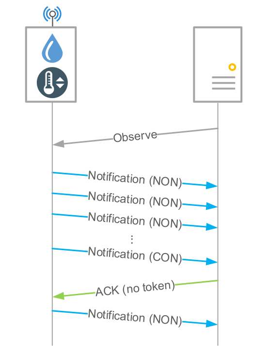

# Dataset Description

**Important notice** 

- Do not read this document before completing the "A look in the dataset" section of the labwork.
- Marion Dumay (@mdumay on GitHub) has contributed a lot to the analysis of this dataset, providing both insight on the LwM2M and CBOR analysis.
- Stéphane Coutant (@scoutant on GitHub) has contributed to the dataset capture and provided the PCAP file.

## Dataset scenario

This dataset is a capture of the traffic exchanged between a thermostat (2001:db8:a::3) and an application server (2001:db8:a::20).

The protocol stack used for this communication is based on IPv6, UDP, CoAP for all datagrams. At the application level, two formats are being used : 

- Lightweight M2M TLV format
- CBOR encoding format

3 lw-M2M resources are described:

- a temperature sensor (resource ID `3303`)
- a humidity sensor (resource ID `3304`) 
- a setpoint (resource ID `3308`).

The following resource IDs of the temperature and humidity sensors are used in the dataset:

- sensor value (resource ID `5700`)
- min measured value (resource ID `5601`)
- max measured value (resource ID `5602`)
- min range value (resource ID `5603`)
- max range value (resource ID `5604`)
- sensor units (resource ID `5701`)

A reset of the min/max measured values is triggered using the resource ID `5605`.

The following resource IDs of the setpoint are used in the dataset:

- setpoint value (resource ID `5900`)
- sensor units (resource ID `5701`)
- color (resource ID `5706`)
- application type (resource ID `5750`)
- timestamp (resource ID `5518`)
- fractional timestamp (resource ID `6050`)

## Traffic characteristics

The dominant traffic is from the device (client) to the server ( `2001:db8::3` -> `2001:db8::20`) and the most frequent packets are readings from sensors, i.e. CoAP code `2.05` (content) & resource ID `5700` (sensor value).
Notice the repeating CoAP Token values, e.g. `d159`, `2150`, `8d43`, `3709` and `1f0a`, each corresponding to an observe subscription, as described in Fig. 1.

The server subscribes with an observe request to a resource whose value he wants to track (such as the temperature and humidity value, min and max). Tracked resources periodically send updates through notifications. Notifications are usually sent without confirmation (NON) but once in a while they are sent as confirmed messages (CON). The server then sends an empty ACK (no token) with the same message ID as the confirmed message. 
The dataset includes notifications using two different formats: the first one has values in lwm2m+tlv and the second one in cbor. In addition, these messages feature an observe sequence number which starts from 1 and is incremented at each new packet. Initially, it is encoded on 1 byte, then when the value exceeds xff, it switches to 2 bytes, and so on.

## Templates

The dataset contains 6 templates:

- template 0: `2001:db8::3` -> `2001:db8::20`, CoAP non-confirmable and confirmable (2.00 and 2.01), LwM2M notifications (resource ID `5700`)
- template 1: `2001:db8::3` -> `2001:db8::20`, CoAP non-confirmable and confirmable (2.00 and 2.01), CBOR notifications, token `1f0a`.
- template 2: `2001:db8::20` -> `2001:db8::3`, ACK (no CoAP Token).
- template 3: `2001:db8::20` -> `2001:db8::3`, CoAP POST --> reset min/max measured values (resource ID `5605`). 
- template 4: `2001:db8::3` -> `2001:db8::20`, ACK (with CoAP Token, CoAP code 2.04)
- template 5: `2001:db8::20` -> `2001:db8::3`, CoAP PUT, confirmable resource ID `5900` (setpoint setting).

